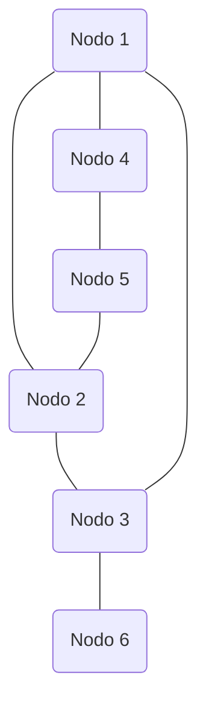
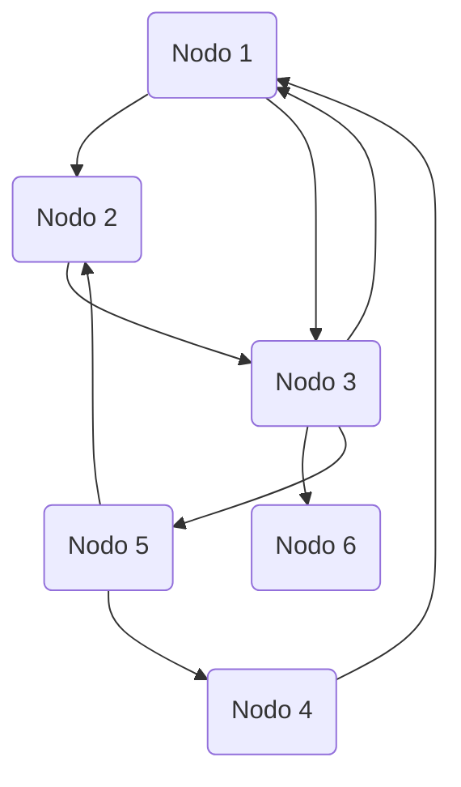
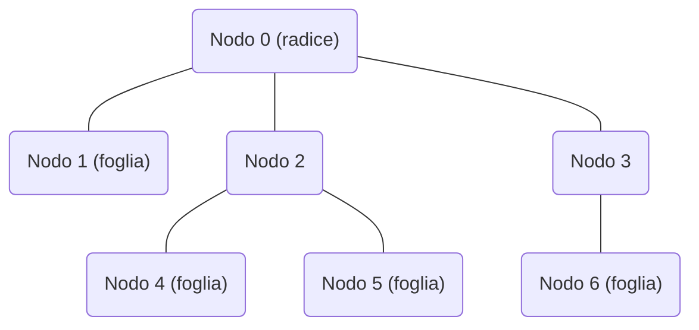

# Competitive Programming (CP)
Lezione 5: Grafi

---

## Risorse
Tutto il materiale del corso puo' essere trovato su https://github.com/lorenzo-frittoli/cp-course
![[static/repo_qrcode.png|250]]

---

## Esempio: Grafo


---

## Teoria: cos'e' un grafo
Un grafo rappresenta una "rete" di elementi connessi.

E' composto da **nodi** connessi da **archi** o **edges**.

---

## Esempio: Grafo Orientato


---

## Teoria: Grafi Orientati
Si dicono **diretti** o **orientati** quei grafi i cui **archi** hanno un **senso di percorrenza**.

In altre parole, gli archi non solo linee ma **frecce**.

---

## Esempio: Albero


---

## Teoria: Alberi
Un albero e' un grafo **aciclico non orientato**.

Il "punto di partenza" e' detto **radice**.

Tutti i nodi tranne la radice hanno un **genitore** (il nodo sopra di loro) e possono avere dei **figli** (i nodi sotto di loro).

I nodi **senza figli** sono detti **foglie**.

Un albero e' detto **radicato** se hai deciso qual e' la radice.

---

## Teoria Implementativa
Possiamo implementare un grafo **orientato** salvando per ogni arco la **lista** dei **nodi** a cui si **collega**.

Se il grafo non e' orientato basta aggiungere due archi che vanno in direzioni opposte.

---

## Implementazione: Python

```py
N = int(input())
M = int(input())

graph = [[] for _ in range(N)]

for _ in range(M):
    start, end = map(int, input().strip().split())

    graph[start].append(end) # Aggiungi l'arco start -> end

    # Da fare se il grafo e' non orientato
    graph[end].append(start) # Aggiungi l'arco end -> start
```

---
