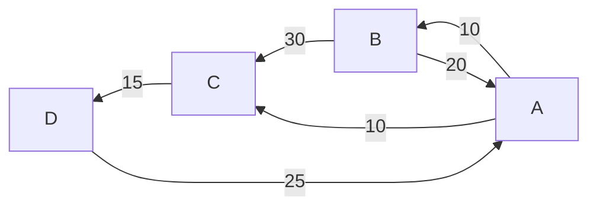

# Competitive Programming (CP)
Lezione 7: Dijkstra

---

## Risorse
Tutto il materiale del corso puo' essere trovato su https://github.com/lorenzo-frittoli/cp-course
![[static/repo_qrcode.png|250]]

---

## Ripasso
Vogliamo esplorare un grafo. Cosa utilizziamo?
Suggerimento: [[./6-bfs-dfs.md|BFS, DFS]].

---

## Problema
Vogliamo esplorare un **grafo pesato**.

Un grafo pesato e' un grafo dove ogni **arco** ha un **peso** associato.

L'obbiettivo e' di trovare la **distanza** fra il nodo $X$ e il nodo $Y$.



---

## Idea
Esploriamo il grafo con una BFS, ma esploriamo i nodi in ordine di **distanza dall'origine** della ricerca.

Per fare questo abbiamo bisogno di una **lista ordinata** rispetto a un **peso** che possa essere **updateata dinamicamente**.

Possiamo usare una **priority queue**.

---

## Implementazione
```py
import queue

def dijkstra(N, M, graph, X, Y):
    distances = [-1 for _ in range(N)]
    pq = queue.PriorityQueue()
    
    pq.push((0, X)) # (peso, elemento)
    distances[X] = 0

    while not pq.empty():

        distance, node = pq.get()
        for weight, neighbour in graph[node]:
            if distances[neighbour] == -1:
                continue

            if neighbour = Y:
                return distance + weight

            distance[neighbour] = distance + weight
            pq.push(distance + weight, neighbour)
```

---

## Problemi Consigliati
**EASY** - [`dijkstra`](https://training.olinfo.it/task/dijkstra)
**MEDIUM** - [`police5`](https://training.olinfo.it/task/ois_police5)
**HARD** - [`cesena`](https://training.olinfo.it/task/itday_cesena)

